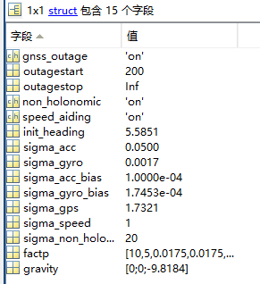
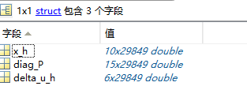
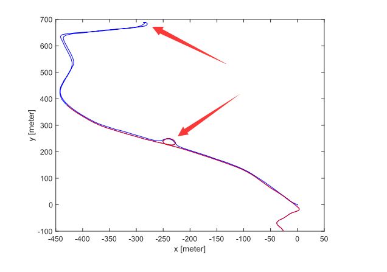
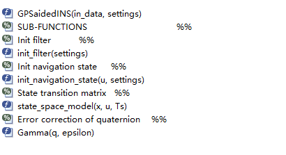

# Note

main.m 是执行的入口，这时候先load `GNSSaidedINS_data.mat` 文件，这个文件里面包含

- GNSS

- SPEEDOMETER

- IMU

  

三个part，先看熟悉的IMU，IMU里面还是包含3个part，数据长度都是29849，接近3w条数据，100HZ采集，大约是300秒钟的样本量

IMU

- t

  时间，大约0.01秒一个间隔，推算出频率是100HZ

- acc

  加速度，每一条包括t时刻x,y,z的信息

- gyro

  角速度，同acc的格式

然后看SPEEDOMETER，速度计

- t

  时间，长度1194

- speed

  速度，长度1194

然后看下GNSS，这里面的东西没见过

- pos_ned

  GNSS-receiver position estimates in NED coordinates [m]，大地坐标系的位置

- HDOP

  GNSS Horizontal Dilution of Precision

- VDOP

  GNSS Vertical Dilution of Precision [-]

  [精度衰减因子 - 维基百科，自由的百科全书 (wikipedia.org)](https://zh.wikipedia.org/wiki/精度衰减因子)

  在[卫星导航](https://zh.wikipedia.org/wiki/卫星导航系统)领域，**精度衰减因子**（英语：Dilution of precision）是一类衡量用户在进行GNSS测量时所具备的几何条件的定量指标[[1\]](https://zh.wikipedia.org/wiki/精度衰减因子#cite_note-:1-1)[[2\]](https://zh.wikipedia.org/wiki/精度衰减因子#cite_note-:0-2)[[3\]](https://zh.wikipedia.org/wiki/精度衰减因子#cite_note-whugps-3)，又简称为**DOP值**或**精度因子**。DOP值的大小取决各导航卫星在用户视场中的分布情况，反映了用户与卫星之间组成的几何图形对[测距误差](https://zh.wikipedia.org/wiki/测量误差)的放大作用：在相同[测距精度](https://zh.wikipedia.org/wiki/测量精度)的条件下，DOP值越低，表明该用户与卫星之间组成的几何图形越为健壮，对测距误差的放大作用越小，GNSS服务提供的导航精度越高。

- t

  Time of GNSS measurements [s]

load完之后，这里用get_settings来配置，进去里面看了下，大概是初始化参数等操作，里面的`FILTER PARAMETERS`比较重要，先把它当成超参的设定吧

`settings`一览

然后下面一大块注释，意义不明，跳过

下面关键的地方就是`GPSaidedINS`这个函数了，上面的`settings`也作为参数传递进去了

最后输出一个out_data，直接画出来了，画出来的图还是很好看的

out_data长这样

里面的详细数据格式比较复杂了

- x_h

  Estimated navigation state vector [position; velocity; attitude]

  位置，速度，姿态，三个重要的参数都在里面了

- delta_u_h

  Estimated IMU biases [accelerometers; gyroscopes]

  估计的IMU偏差，加速度仪，陀螺仪

- diag_P

  Diagonal elements of the Kalman filter state covariance matrix.

  没看懂这东西是什么

  

目前为止大概知道怎么回事了，GPS和speedometer不是全程采集的，我们依赖的主要是IMU数据，文档里面也说了，模拟了大约200秒的GPS丢失。采集数据频率也给了：The data rates of the sensors are: GPS (1Hz), IMU (100Hz) and speedometer (4Hz)

大致轨迹是绕了一圈，红色轨迹是GPS丢失的时候，是后半段，刚开始是没有丢失的，是蓝色的线段

下面详细看一下`GPSaidedINS`这个文件

---

**GPSaidedINS**

这文件注释写得很清楚啊，之前的数据字段都有说明了

整个文件的结构

**Initialization**

一进来是Initialization模块，接着调用了一个`init_navigation_state`函数，参数是`u`和`settings`，`u`里面存放的是`acc`和`gyro`数据，直接就返回`x_h`了，看来这个函数内部做了不少的工作

然后有一个`delta_u_h`的参数单独拎出来，注释写的`sensor bias estimate`，就是模拟传感器误差的

下面还有一个`init_filter`的，注释写的初始化卡尔曼滤波

然后下面就是分配初始值了

**Information fusion**

紧接着是fusion，这部分没写函数，大概100多行的代码，细节全部暴露出来了，看看是怎么处理的

直接一个k从2到N的循环，Ts是时间间隔，然后调用`Nav_eq(x_h,u_h,Ts,settings.gravity)`得到x_